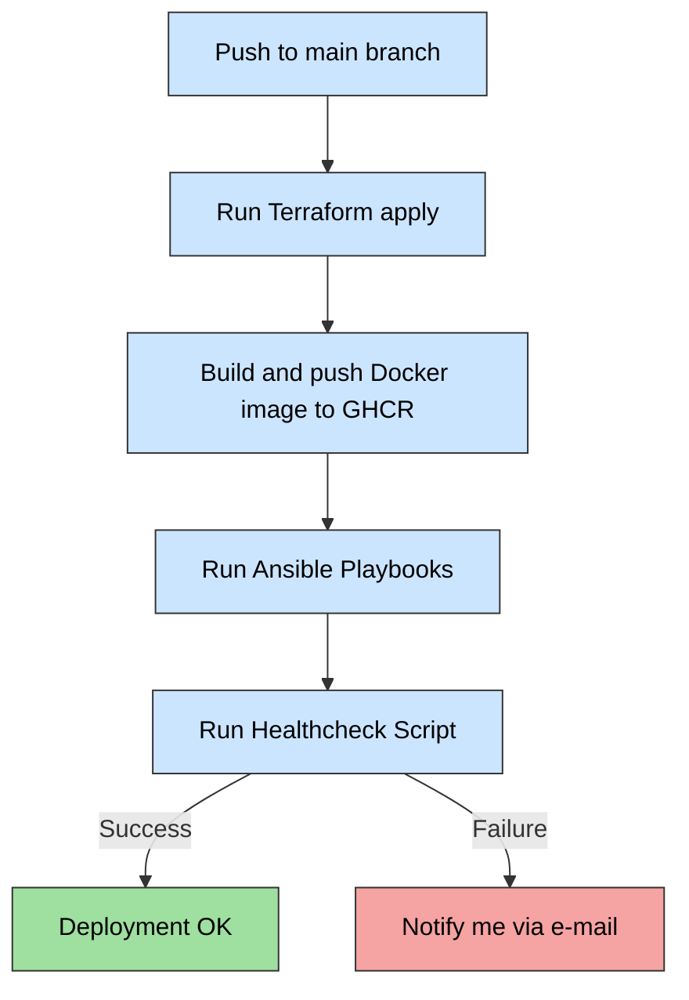

# Portfolio DevOps Project

This project is a personal DevOps portfolio repository. This repository is public for demonstration and inspiration purposes. It was created as an after-hours side-project to showcase infrastructure, tooling and CI/CD patterns for a personal portfolio.No real credentials, private keys, hostnames, ports or IP addresses are included.

### GitHub Actions workflows 
| GitHub Action                  | Status | Function |
|-------------------------------|-------| -----|
| Deployment     |  | Build & provisioning |
| VMs online/offline schedule |  | Cost optymalization |
| Terraform tfstate watcher | | Drift detection |
| Terraform auto documentation | | Documentation|
| Vulnerability scanner | [portfolio-vulnerability-scan.yaml](.github\workflows\portfolio-vulnerability-scan.yaml) - disabled on public repo due to security reasons but working fine on the private | Security |

### Setup using the stack below

| Category                     | Tools / Technology |
|-------------------------------|------------------|
| **CI/CD**                     | GitHub Actions |
| **Infrastructure as Code**    | Terraform & Ansible |
| **Containerization and build** | Docker |
| **Web / API**                 | NGINX |
| **Cloud**                     | Google Cloud Platform |
| **Central Monitoring**        | ELK Stack + Beats |
| **Operating System**          | Linux Debian |
| **Scripting**                 | Custom bash scripts |
| **Security**                  | Firewall rules, HTTPS / SSL, Cloudflare WAF, Trivy, logrotate |

It automates the following processes:

### Terraform
- Deployment of **2 VMs** on **Google Cloud Platform (GCP)**  
  - **1) Application VM** for running the Node.js application with NGINX  
  - **2) Central monitoring VM** with Elasticsearch, Logstash, and Kibana  
- Configuration of **network, firewall rules, disks, and snapshots** 

### Ansible
- Installation of **Docker** and deployment of containers  
- Deployment **Node.js** containers 
- Deplyoment **NGINX** containers and **HTTPS / SSL / TLS** setup (optional basic authentication)
- Deployment **ELK** containers cluster as a central log monitoring system  
- Manage log rotation for application and NGINX logs  
- Setup of **Metricbeat** and **Filebeat** on the machines

## Security Notice

This repository is **public** for demonstration and inspiration purposes.  
It was created as an after-hours side-project to showcase infrastructure, tooling and CI/CD patterns as part of my devops portfolio.

- **No sensitive data is included** (no private keys, passwords, hostnames, public ports or real IP addresses).  
- All credentials and secrets must be provided via GitHub Actions Secrets or environment variables — **without them the resources will not be reachable or operational**.  
- **DO NOT** attempt to connect to any resources using information from this repository, everything in the real environment is protected and will fail without proper environment configuration.

## Application infra schema

- Cloudflare – Handles HTTPS, CDN, and DDoS protection.
- NGINX – Reverse proxy with SSL/TLS termination; optional basic authentication.
- Node.js App Containers – The application runs in two separate containers for load balancing or redundancy.
- Storage (GCP Disk) – Persistent disk attached to the VM for storing application data and logs.

## CI/CD

CI/CD flow diagram:

The project includes a **GitHub Actions workflow** that can:

**Deplyoment GH Action**
[portfolio-cicd.yaml](.github/workflows/portfolio-cicd.yaml)
  1. Run Terraform apply to build infrastracture
  2. Build image and push it to GitHub Container Registry
  3. Run Ansible playbooks to deploy the applications 
  3. Run [healthcheck.sh](.github/scripts/healthcheck.sh) to check the deployment result 

Additional CI/CD Features
1. **Auto-managed VM Schedule**  
   Automatically turns off VMs at 01:00 and turns them on at 07:00 for cost optimization.  
   Workflow: [portfolio-terraform-infra-watcher.yaml](.github/workflows/portfolio-terraform-infra-watcher.yaml)

2. **Terraform Infrastructure Watcher**  
   Scheduled runs to check whether the infrastructure matches the Terraform state or needs updates.  
   Workflow: [portfolio-vm-auto.yaml](.github/workflows/portfolio-vm-auto.yaml)

3. **Terraform Auto-Documentation**  
   Automatically generates up-to-date Terraform documentation.  
   Workflow: [portfolio-cicd-terraform-autodoc.yaml](.github/workflows/portfolio-cicd-terraform-autodoc.yaml)  
   Documentation: [Terraform Docs](/terraform/README_terraform.md)

4. **Image Vulnerability Scanning**  
   Scans Docker images for vulnerabilities.  
   Workflow: [portfolio-vulnerability-scan.yaml](.github/workflows/portfolio-vulnerability-scan.yaml)

## Features

- Infrastructure as code (IaC) using Terraform – tfstate is versioned and protected in Google Cloud Bucket, available to CI/CD.
- Node.js application served via NGINX.
- Automatic HTTPS setup.
- Centralized log observability using ELK Stack:
  - Logstash parses NGINX and application logs, extracts structured fields, and enriches them for easier filtering and analysis.
  - Elasticsearch stores logs in indexes with a defined index lifecycle policy (created via Logstash pipelines), enabling automated retention and rotation of logs.
  - Kibana provides dashboards and alerts, with automatic log rotation and visualization of structured data.
- GitHub Actions for automated deployments (portfolio-cicd.yaml).
- Terraform docs automatically generated in markdown (README.md) via terraform-docs.

## CI/CD Management

- GitHub Actions workflows are executed on ephemeral **public runners**.  
- All secrets and sensitive data (SSH keys, vault passwords, environment variables) are only available **during the workflow run**.  
- After the run completes, the runner is destroyed, and all sensitive data is automatically wiped.  
- No secrets are stored in the repository or on the runners permanently.  
- Workflows are designed to pull secrets only from **GitHub Actions secrets** or environment variables, never from the codebase.

## Notes

- Secrets like SSH keys, domain certificates, and GCP credentials are **not stored in the repository**. They are passed via GitHub Actions secrets.
- Only IPv4 addresses are whitelisted for GitHub Actions runners.

## Security Notice – Part 2

In addition to the general notice above, the live environment has been hardened with several security measures. While this repository only shows demonstration infrastructure, the deployed resources are secured as follows:

- **Terraform state and sensitive variables**:  
  - The `terraform.tfstate` file is **not included** in this repository.  
  - All sensitive names and configuration values (project IDs, VM names, IP addresses, etc.) are provided via **environment variables** or CI/CD secrets, never hardcoded.

- **Restricted SSH access**:  
  - SSH is only possible on a custom non-standard port (known only to me).  
  - Source IPs are whitelisted — only my personal IP and GitHub Actions runners are allowed.  

- **Web server hardening (NGINX)**:  
  - `server_tokens` disabled (no version leaks).  
  - Strict security headers configured (HSTS, X-Frame-Options, X-Content-Type-Options, etc.).  
  - Traffic served exclusively via **HTTPS** (HTTP disabled).  

- **Perimeter security**:  
  - Firewall rules applied on GCP VPC, restricting inbound traffic to the minimum required.  
  - Outbound egress restricted where possible.  
  - Cloudflare acts as a proxy, adding DDoS protection, TLS termination, and basic WAF filtering.  

- **Secrets management**:  
  - No credentials are hardcoded in the repository.  
  - All access keys, vault passwords, and configuration values are injected via GitHub Actions secrets or environment variables. 

The codebase is public for demonstration and inspiration purposes, the actual environment remains safe and inaccessible without the proper secrets and configurations.