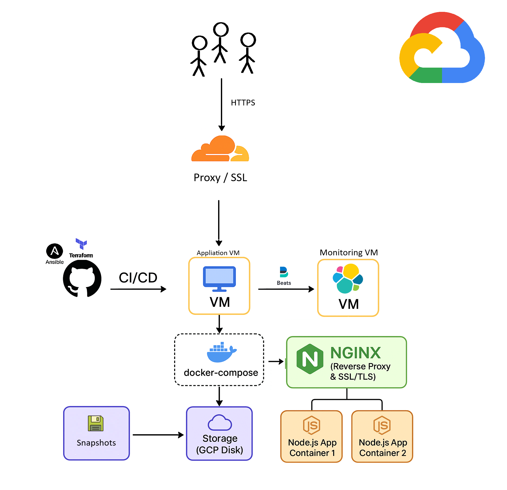
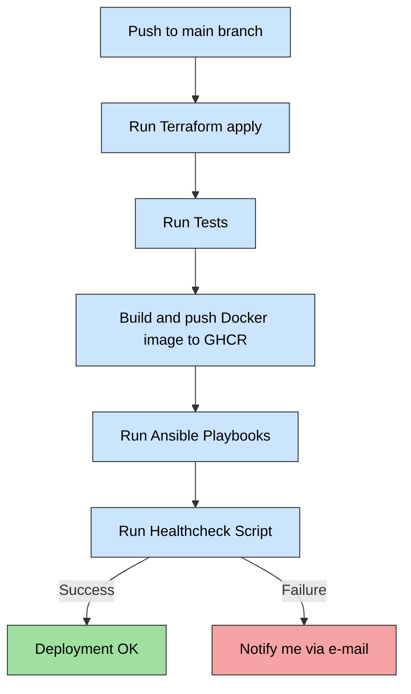

# Portfolio DevOps Project

This project is a personal DevOps portfolio repository. This repository is public for demonstration and inspiration purposes. It was created as an after-hours side-project to showcase infrastructure, tooling and CI/CD patterns for a personal portfolio. No real credentials, private keys, hostnames, ports or IP addresses are included.

---

### GitHub Actions workflows 
| GitHub Action                  | Status | Function |
|-------------------------------|-------| -----|
| Deployment     |  | Build & provisioning |
| VMs online/offline schedule |  | Cost optymalization |
| Terraform tfstate watcher | | Drift detection |
| Terraform auto documentation | | Auto-documentation|
| Vulnerability scanner | [portfolio-vulnerability-scan.yaml](.github\workflows\portfolio-vulnerability-scan.yaml) - disabled on public repo due to security reasons but working fine on the private | Security |
| Run website-check | | Run custom container image (simple site health-check)|

---

## Table of Contents

1. [Project Overview](#project-overview)
2. [Setup and Stack](#setup-and-stack)
3. [Infra schema](#infra-schema)
4. [Infrastructure (Terraform)](#infrastructure-terraform)
5. [Provisioning (Ansible)](#provisioning-ansible)
6. [CI/CD Flow (GitHub Actions)](#cicd-flow)
7. [Security](#security)
8. [Prometheus & Grafana](#prometheus--grafana)
9. [Active monitoring](#active-monitoring)
10. [Features](#features)

### Project Overview

This repository demonstrates:

- Infrastructure as Code (Terraform & Ansible)
- Containerized Node.js application with NGINX
- Centralized monitoring using ELK Stack
- Automated CI/CD pipelines with GitHub Actions (TEST -> BUILD -> DEPLOY -> MONITOR -> MAINTAIN)
- Security best practices (firewall, HTTPS, WAF, log rotation, vulnerability scanning)

---

### Setup and Stack

| Category                     | Tools / Technology |
|-------------------------------|------------------|
| **CI/CD**                     | [GitHub Actions](.github/workflows/) |
| **Infrastructure as Code**    | [Terraform](/terraform/) & [Ansible](/ansible/) |
| **Containerization and build** | [Docker](/ansible/roles/docker/) |
| **Web / API**                 | [NGINX](/ansible/roles/nginx/) |
| **Cloud**                     | Google Cloud Platform |
| **Central Monitoring**        | [ELK Stack + Beats](/ansible/roles/elk/) |
| **Application Monitoring**    | Prometheus & Grafana |
| **Operating System**          | Linux Debian |
| **Scripting**                 | [Custom bash scripts](/.github/scripts/) |
| **Security**                  | Firewall rules, HTTPS / SSL, Cloudflare WAF, Trivy, logrotate |
| **Tests**                  | [jest & supertest](/nodeApp/__tests__/server.test.js) |

---

### Infra schema

- Cloudflare – Handles HTTPS, CDN, and DDoS protection.
- NGINX – Reverse proxy with SSL/TLS termination; optional basic authentication.
- Node.js App Containers – The application runs in two separate containers for load balancing or redundancy.
- Storage (GCP Disk) – Persistent disk attached to the VM for storing application data and logs.

---

### Infrastracture (Terraform)

GCP:
- Deployment of **2 VMs** on **Google Cloud Platform (GCP)**  
  - **1) Application VM** for running the Node.js application with NGINX  
  - **2) Central monitoring VM** with Elasticsearch, Logstash, and Kibana  
- Configuration of **network, firewall rules, disks, and snapshots**
- Whitelist IP list retrived from directly from [vendor's APi](terraform/modules/firewall/main.tf):
  - https://www.cloudflare.com/ips-v4 - ALLOW HTTPS
  - https://www.cloudflare.com/ips-v6 - ALLOW HTTPS
  - https://api.github.com/meta - ALLOW SSH (Runners are using Ansible)

CloudFlare:
- Setup of custom firewall rules

---

### Provisioning (Ansible)
- Installation of **Docker** and deployment of containers  
- Deployment **Node.js** containers 
- Deplyoment **NGINX** containers and **HTTPS / SSL / TLS** setup (optional basic authentication)
- Deployment **ELK** containers cluster as a central log monitoring system 
- Deployment of **Logstash** container as entry point for all logs, parses them, enriches them with structured fields, and forwards to Elasticsearch Index for storage and analysis.
- Manage log rotation for application and NGINX logs  
- Setup of **Metricbeat** and **Filebeat** on the machines

---

## CI/CD flow

CI/CD deployment flow diagram:

The project includes a **GitHub Actions workflow** that can:

**Deplyoment GH Action**
[portfolio-cicd.yaml](.github/workflows/portfolio-cicd.yaml)
  1. Run Terraform apply to build infrastracture
  2. Run application tests and check tests result, then save test result as artifact
  3. Build image and push it to GitHub Container Registry
  4. Run Ansible playbooks to deploy the applications 
  5. Run [healthcheck.sh](.github/scripts/healthcheck.sh) to check the deployment result 

Additional CI/CD Features
1. **Auto-managed VM Schedule**  
   Automatically turns off VMs at 01:00 and turns them on at 07:00 for cost optimization.  
   Workflow: [portfolio-terraform-infra-watcher.yaml](.github/workflows/portfolio-terraform-infra-watcher.yaml)

2. **Terraform Infrastructure Watcher**  
   Scheduled runs to check whether the infrastructure matches the Terraform state or needs updates.  
   Workflow: [portfolio-vm-auto.yaml](.github/workflows/portfolio-vm-auto.yaml)

3. **Terraform Auto-Documentation**  
   Automatically generates up-to-date Terraform documentation.  
   Workflow: [portfolio-cicd-terraform-autodoc.yaml](.github/workflows/portfolio-cicd-terraform-autodoc.yaml)  
   Documentation: [Terraform Docs](/terraform/README_terraform.md)

4. **Image Vulnerability Scanning**  
   Scans Docker images for vulnerabilities.  
   Workflow: [portfolio-vulnerability-scan.yaml](.github/workflows/portfolio-vulnerability-scan.yaml)

CI/CD specific:
- GitHub Actions workflows are executed on ephemeral **public runners**  
- All secrets and sensitive data (SSH keys, vault passwords, environment variables) are only available **during the workflow run**.  
- After the run completes, the runner is destroyed, and all sensitive data is automatically wiped 
- No secrets are stored in the repository or on the runners permanently.  
- Workflows are designed to pull secrets only from **GitHub Actions secrets** or environment variables, never from the codebase

---

## Security

- **No sensitive data is included** (no private keys, passwords, hostnames, public ports or real IP addresses).  
- All credentials and secrets must be provided via GitHub Actions Secrets or environment variables — **without them the resources will not be reachable or operational**.  
- **DO NOT** attempt to connect to any resources using information from this repository, everything in the real environment is protected and will fail without proper environment configuration
- Secrets like SSH keys, domain certificates, and GCP credentials are **not stored in the repository**. They are passed via GitHub Actions secrets
- Only IPv4 addresses are whitelisted for GitHub Actions runners

In addition to the general notice above, the live environment has been hardened with several security measures. While this repository only shows demonstration infrastructure, the deployed resources are secured as follows:

- **Terraform state and sensitive variables**:  
  - The `terraform.tfstate` file is **not included** in this repository  
  - All sensitive names and configuration values (project IDs, VM names, IP addresses, etc.) are provided via **environment variables** or CI/CD secrets, never hardcoded

- **Restricted SSH access**:  
  - SSH is only possible on a custom non-standard port (known only to me)  
  - Source IPs are whitelisted — only my personal IP and GitHub Actions runners are allowed  

- **Web server hardening (NGINX)**:  
  - `server_tokens` disabled (no version leaks)  
  - Strict security headers configured (HSTS, X-Frame-Options, X-Content-Type-Options, etc.).  
  - Traffic served exclusively via **HTTPS** (HTTP disabled) 
  - Rate limit requests per seconds 
  - Custom 403 page
  - Traffic restricted only to applicaiton public endpoints

- **Perimeter security**:  
  - Firewall rules applied on GCP VPC, restricting inbound traffic to the minimum required
  - Outbound egress restricted where possible  
  - Cloudflare acts as a proxy, adding DDoS protection, TLS termination, and basic WAF filtering  

- **Secrets management**:  
  - No credentials are hardcoded in the repository  
  - All access keys, vault passwords, and configuration values are injected via GitHub Actions secrets or environment variables 

The codebase is public for demonstration and inspiration purposes, the actual environment remains safe and inaccessible without the proper secrets and configurations.

---

## Prometheus & Grafana

Prometheus is used in this project to collect and visualize application metrics. The Node.js application exposes a `/metrics` endpoint, which provides real-time statistics in a format compatible with Prometheus. These metrics include request counts, response times, and other operational data useful for monitoring and alerting.

For demonstration purposes and due to limited cloud resources I decided to host Prometheus & Grafana to scrape metrics from the application on my local Minikube Kubernetes cluster. 

This setup allows for easy testing and visualization if needed of metrics without incurring additional cloud costs. The `/metrics` endpoints are exposed via NGINX, making them accessible for Prometheus scraping and compatible with HTTPS.

- Metrics endpoint: `/metrics1` and `/metrics2` (proxied and protected via `basic_auth` by NGINX to individual Node.js containers)

This approach demonstrates how application metrics can be integrated and visualized using Prometheus, even in a constrained environment. For production deployments, Prometheus would typically be configured to scrape metrics directly from the application instances running in the cloud, providing a comprehensive view of the application's performance and reliability.

Find more: https://github.com/hkarol-10/portfolio-prometheus

---

## Active monitoring

A simple Python script is used to check the availability of the portfolio website. The script is containerized with Docker and built automatically by GitHub Actions. 
It runs on a scheduled workflow ([portfolio-website-check.yaml](.github/workflows/portfolio-website-check.yaml)) every hour, and sends notifications to Slack via webhook if the website is unreachable or returns an unexpected status code.

This is not a production-grade monitoring solution, but a quick demonstration of the concept: automated status checks, containerization, CI/CD integration, and Slack notifications. The entire solution can be easily migrated to Cloud Run or any other serverless environment if needed.

- Monitoring script: [main.py](cloudrun/monitoring-tool/main.py)
- Container build workflow: [portfolio-build-monitoring-tool.yaml](.github/workflows/portfolio-build-monitoring-tool.yaml)
- Scheduled monitoring workflow: [portfolio-website-check.yaml](.github/workflows/portfolio-website-check.yaml)
- Slack integration via webhook (configured as a secret/environment variable)

---

## Features

- Infrastructure as code (IaC) using Terraform – tfstate is versioned and protected in Google Cloud Bucket, available to CI/CD.
- Node.js application served via NGINX.
- Automatic HTTPS setup.
- Centralized log observability using ELK Stack:
  - Logstash parses NGINX and application logs, extracts structured fields, and enriches them for easier filtering and analysis.
  - Elasticsearch stores logs in indexes with a defined index lifecycle policy (created via Logstash pipelines), enabling automated retention and rotation of logs.
  - Kibana provides dashboards and alerts, with automatic log rotation and visualization of structured data.
- GitHub Actions for automated deployments (portfolio-cicd.yaml).
- Terraform docs automatically generated in markdown (README.md) via terraform-docs.
- Custom VM aliases [ansible managed block](ansible/roles/bootstrap/tasks/bashrc.yaml):       
      alias home='cd /mnt/data'
      alias gtl='cd /mnt/data/logs'
      alias dckr='cd /mnt/data/docker'

- [ELK cluster fine tuining](/ansible/roles/docker/templates/docker-compose-nginx-elk.yml.j2) `ES_JAVA_OPTS` & `limits` - VM remain stable and safe with running applications

- Kibana - map of events collected by `tracker_parsed` tracker, visualized in Kibana:

- Kibana - hosts metric observability collected by `metricbeat` visualized in Kibana:
